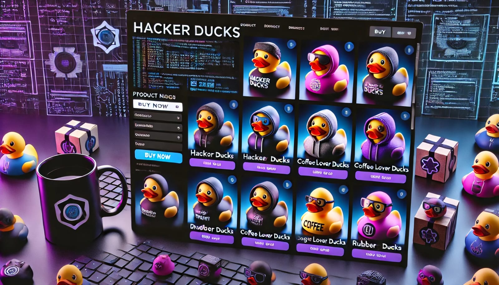
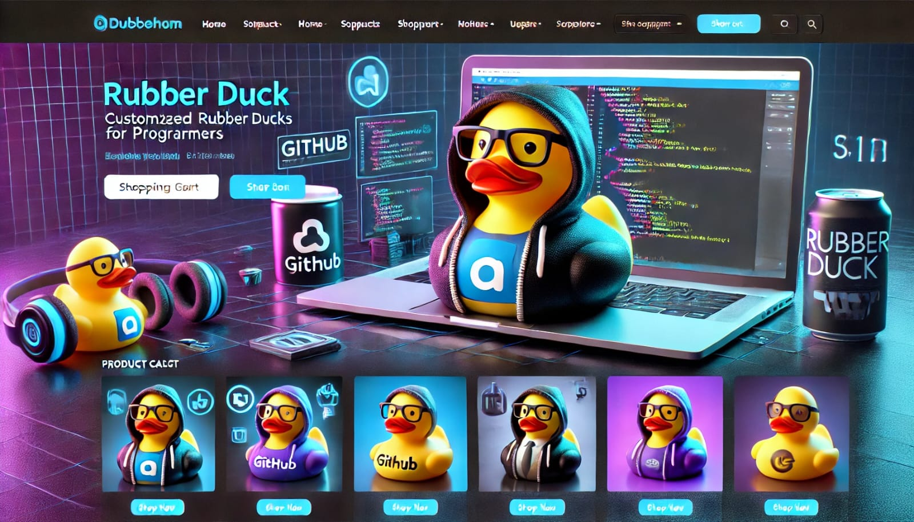
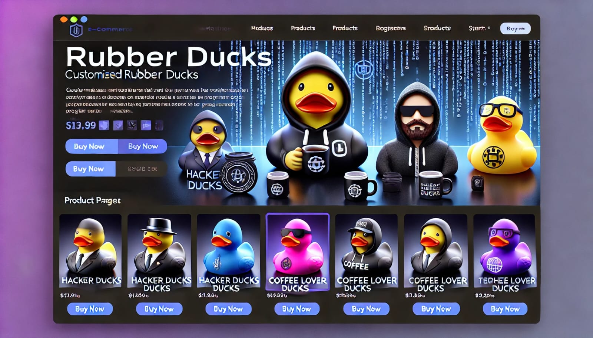
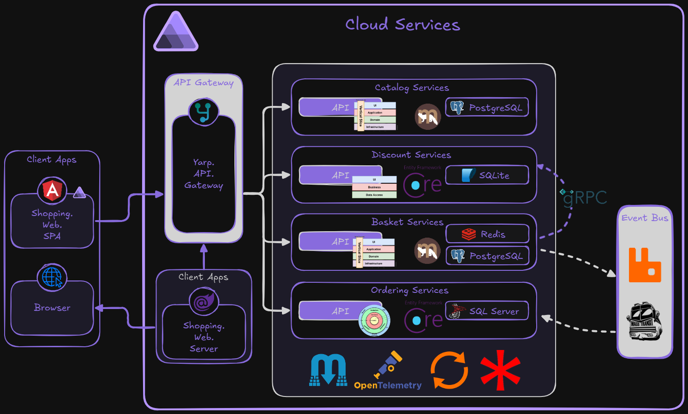

# DuckStore

DuckStore é uma aplicação de e-commerce moderna e escalável, projetada para demonstrar conceitos avançados de arquitetura de software e integração de tecnologias. Este projeto utiliza uma abordagem baseada em microsserviços para oferecer uma solução robusta e flexível.

---

## 📜 Conceito

O DuckStore é um exemplo de e-commerce que permite aos usuários gerenciar carrinhos de compras, aplicar descontos e realizar transações de forma eficiente. Ele simula um ambiente real de comércio eletrônico, integrando serviços como banco de dados, cache, mensageria e APIs externas.

#### 🖼️ Design Inspirations





---

## 📐 Arquitetura

A arquitetura do DuckStore é baseada em microsserviços, com comunicação assíncrona entre os serviços. Abaixo está uma visão geral da arquitetura:



Cada serviço é responsável por uma funcionalidade específica, como gerenciamento de carrinho, descontos e processamento de pedidos. A comunicação entre os serviços é feita utilizando RabbitMQ como broker de mensagens.

---

## 🛠️ Tecnologias Utilizadas

- **C# e .NET**: Linguagem e framework principal para desenvolvimento.
- **RabbitMQ**: Mensageria para comunicação assíncrona entre microsserviços.
- **PostgreSQL**: Banco de dados relacional para persistência de dados.
- **Redis**: Cache distribuído para melhorar a performance.
- **Marten**: Biblioteca para manipulação de dados no PostgreSQL.
- **MassTransit**: Framework para integração com RabbitMQ.
- **FluentValidation**: Validação de dados.
- **Carter**: Framework minimalista para APIs.
- **gRPC**: Comunicação eficiente entre serviços.

---

## 🚀 Como Iniciar o Projeto

### Pré-requisitos

- .NET SDK 9.0 ou superior
- Docker (opcional, para serviços como RabbitMQ, PostgreSQL e Redis)
- Visual Studio Code com a extensão **C# Dev Kit**

### Passos para Iniciar

Clone o repositório:
   ```bash
   git clone [Github](https://github.com/KeveenMenezes/DuckStore.git)
   cd DuckStore
   ```

Utilize a extensão **C# Dev Kit** para iniciar o projeto:
   - Pressione `F5` e selecione o folder `C#`.
   - Escolha o projeto `C#: AppHost` para iniciar.

## 📧 Contato

Para dúvidas ou sugestões, entre em contato pelo [Linkedin](https://www.linkedin.com/in/keveen-menezes-52592162/)

---
